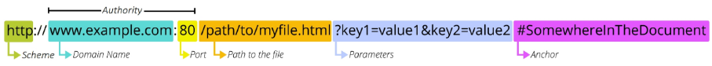

# REST API
## API란?
- API(Application Programming Interface)
    - 두 소프트웨어가 서로 통신 할 수 있게 하는 메커니즘
- 예시: 클라이언트-서버처럼 서로 다른 프로그램에서 요청과 응답을 받을 수 있도록 만든 체계
- 하나의 프로그램이 다른 프로그램에게 정보를 보내거나 요청할 때, 서로 이해할 수 있는 공통된 규칙과 형식
- 서버에서 지정한 형식에 맞춰 요청하면 응답(정보제공)해줌
- Third Party Open API 서비스
    - Youtube, Google 등 외부의 서비스 제공하는 주체
## REST API란?
- REST(Representational State Transfer)
    - API Server를 개발하기 위한 일종의 소프트웨어 설계 방법론
    - 엄격한 규칙을 의미하는 것은 아님
    - API 마다 제각각인 구조를 정리하고, 누구나 예측 가능한 방식으로 통신할 수 있도록 설계 기준을 제안한 것
- RESTful API
    - 자원을 정의, 자원에 대한 주소를 지정하는 전반적인 방법을 서술
    - 자원의 식별
        - URI(Uniform Resource Identifier - 통합 자원 식별자)
        - 인터넷에서 리소스(자원)를 식별하는 문자열
        - URL(Uniform Resource Locator - 통합 자원 위치)
            - 가장 일반적인 URI는 웹 주소로 알려진 URL
            - 웹에서 주어진 리소스의 주소
            - 네트워크 상에 리소스가 어디 있는지를 알려주기 위한 약속
            - 
                - Schema(or Protocol)
                    - 브라우저가 리소스를 요청하는 데 사용해야 하는 **규약**
                    - URL의 첫 부분은 브라우저가 어떤 규약을 사용하는지를 나타냄
                    - 기본적으로 웹은 http(s)를 요구
                - Domain Name
                    - 요청 중인 **웹 서버**를 나타냄
                    - 어떤 웹 서버가 요구되는 지를 가리키며 직접 IP 주소를 사용하는 것도 가능하지만, 사람이 외우기 어렵기 때문에 주로 Domain Name으로 사용
                - Port
                    - 웹 서버의 **리소스에 접근**하는데 사용되는 기술적인 문(Gate)
                    - HTTP 프로토콜의 표준 포트(표준 포트는 생략 가능)
                        - HTTP - 80
                        - HTTPS - 443
                - Path
                    - 웹 서버의 **리소스 경로**
                    - 초기에는 실제 파일이 위치한 물리적 위치를 나타냈지만, 현재 실제 위치가 아닌 추상화된 형태의 구조를 표현
                - Parameters
                    - 웹 서버에 제공하는 추가적인 데이터
                    - '&' 기호로 구분되는 key-value 쌍 목록
                    - 서버는 리소스를 응답하기 전에 이러한 파라미터를 사용하여 추가 작업을 수행할 수 있음
                - Anchor
                    - 일종의 '북마크'를 나타내며 브라우저에 해당 지점에 있는 콘텐츠를 표시
                    - '#' 이후 부분은 서버에 전송되지 않음
                    - 브라우저에게 해당 지점으로 이동할 수 있도록 함
    - 자원의 행위
        - HTTP Request Methods
        - 리소스에 대한 행위, 수행하고자 하는 동작을 정의
            - GET
                - 서버에 리소스 표현 요청, 주로 검색
            - POST
                - 데이터를 리소스에 제출
                - 서버의 상태를 변경
            - PUT
                - 요청한 주소의 리소스를 수정
            - DELETE
                - 지정된 리소스 삭제
        - HTTP response status codes
            - 특정 HTTP 요청이 성공적으로 완료 되었는지 여부 나타냄(숫자로)
    - 자원의 표현
        - JSON 데이터
        - HTML이 아닌 JSON만 전달할 경우 응답 용량 줄고 처리 속도가 빨라짐
    - REST 원리를 따르는 시스템을 RESTful 하다고 부름

## RESTful 과 REST API 차이
- Restful
    - URI에 동사를 쓰지 않고(GET /get_user (X) → GET /users (O)), HTTP 상태 코드(200, 201, 404 등)를 적절히 사용하는 것을 RESTful하다고 표현
- REST API
    - REST 아키텍처의 규칙을 어느 정도 따르는 API를 통칭합니다.
- RESTful
    - REST의 설계 원칙(제약 조건)을 완벽하게 준수하는 디자인을 의미합니다.
## Django REST API 정의와 간략 사용법
- Django 는 웹 페이지(HTML) 렌더링할 수 있음(풀스택)
- REST API를 쉽게 만들어주는 것이 Django REST Framework(DRF) 오픈소스 라이브러리
- model -> Serializer -> View -> URL
- 라이브러리 설치 -> settings 설정 ->